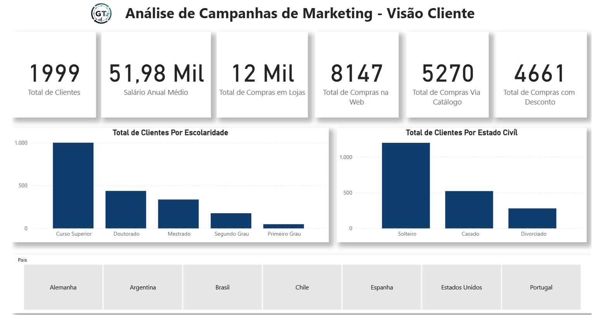

# 🎯 Análise de Perfil de Clientes e Efetividade de Marketing

## 💼 O Problema de Negócio
O time de marketing disparava campanhas generalistas para toda a base de clientes, resultando em custos elevados e baixa conversão. A empresa não tinha clareza sobre o **Perfil de Cliente Ideal (ICP)**: não se sabia exatamente como a renda, a escolaridade ou a estrutura familiar (filhos em casa) impactavam a decisão de compra, dificultando a segmentação estratégica.

## 🎯 Objetivo
Desenvolver um painel de Business Intelligence para segmentar a base de consumidores, identificar os padrões demográficos dos clientes mais rentáveis e avaliar a eficácia real das campanhas passadas para direcionar ações futuras com maior assertividade.

## 🛠️ Tecnologias Utilizadas
* **Power BI:** Visualização de dados e storytelling (Navegação entre páginas).
* **Power Query:** Tratamento de dados para categorização de faixas salariais e limpeza de registros.
* **DAX:** Medidas para cálculo de Ticket Médio, Taxa de Conversão Global e segmentação dinâmica.
* **Modelagem:** Relacionamento entre dados transacionais e demográficos.

## 📊 Estrutura da Análise (Navegação)

O projeto foi dividido em 4 visões estratégicas para responder perguntas diferentes:

### 1. Visão Geral (Overview)
* **Métricas Macro:** Total de clientes, Salário Médio Anual (52k) e distribuição de compras por canal (Web, Loja Física, Catálogo).
* **Demografia:** Análise da base por nível de escolaridade (Predominância de Nível Superior) e Estado Civil.

### 2. Comportamento de Compra
* **Fatores de Influência:** Cruzamento entre **Renda vs. Gastos**, provando a correlação positiva entre salário e volume de compras.
* **Impacto Familiar:** Análise crucial mostrando como o número de **filhos e adolescentes em casa** reduz drasticamente o ticket médio do cliente.
* **Árvore de Decomposição:** Exploração de quais perfis geram maior gasto total (Solteiros > Casados).

### 3. Performance da Campanha
* **Conversão:** Taxa global de aceite da campanha (**16,01%**).
* **Perfil do Comprador:** Comparativo direto mostrando que quem aceitou a oferta tem média salarial superior (**59k**) a quem recusou (**51k**).
* **Detalhamento:** Tabela matricial cruzando status de compra com escolaridade e estado civil.

### 4. Padrões Geográficos e Temporais
* **Mercados Principais:** Ranking de gastos por país, destacando a liderança absoluta dos **EUA**, seguidos pela Espanha.
* **Tendência:** Evolução do faturamento anual (2018-2023) por país, permitindo identificar crescimento ou estagnação em mercados específicos.

## 🚀 Resultados e Insights de Negócio

1.  **O "Vilão" do Consumo:** Identificou-se que clientes **sem filhos** gastam substancialmente mais do que aqueles com 1 ou mais filhos. *Recomendação: Criar ofertas agressivas focadas em casais sem filhos e solteiros.*

2.  **Sensibilidade à Renda:** A campanha teve maior adesão no público com renda média anual acima de **59 mil**. *Ação: Segmentar listas de disparo focando nesse tier de renda para otimizar o ROI.*

3.  **Domínio Geográfico:** Os EUA representam a maior fatia da receita e crescimento constante. Mercados como Brasil e Chile apresentam volume residual, sugerindo necessidade de localização da estratégia ou descontinuidade.

4.  **Omnicanalidade:** Apesar do foco digital, as **Lojas Físicas** (12 Mil compras) ainda superam a Web (8 Mil), indicando que a estratégia não pode ser puramente online.

---
*Este projeto foi desenvolvido como parte de um portfólio de Data Analytics, focado em Customer Intelligence e Estratégia Comercial.*
